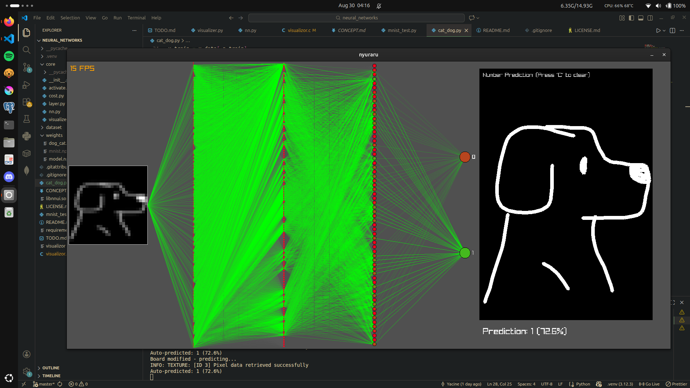

# ニューラル 

Deep-learning library for visualing neural networks training results and tests depending on cost/loss functions chosen

---

Test from `mnist_test.py`

https://github.com/user-attachments/assets/ab7a51c3-919d-491a-8ca9-db08405a5a56

Test from `cat_dog.py`, `{1:dog, 0:cat}`



---

## What it does

- create your custom neural network
- choose activation and Loss functions
- train it on a npy dataset
- test it to evaluate it
- visualize training
- real-time tests

## How it works:

### Initialize Layers and Neural Network:

```py
from core.nn import NN
from core.layer import Layer

input_layer = Layer(28 * 28)
hidden_layer = [
	Layer(128, activation="relu"),
	Layer(64, activation="relu"),
	Layer(64, activation="relu"),
]
output_layer = Layer(10, activation="softmax")
neural_network = NN(input_layer, hidden_layer, output_layer, "CCE")
```

### Training:
---

https://github.com/user-attachments/assets/41b1dd95-9ee8-4a62-8772-b0daf8bc0029

---

if you dont have a model yet u can train ur model using .npy dataset (make sure to split to x,y train), else it will be loaded by itself.

repo provides trained models that u can test with `predict_loop()` or `evaluate()`, located in `weights/`.

```py
x_train = np.load('./dataset/x_train.npy')
y_train = np.load('./dataset/y_train.npy')
x_test = np.load('./dataset/x_test.npy')
y_test = np.load('./dataset/y_test.npy')

x_train = x_train.reshape(60000, 784) / 255.0
x_test = x_test.reshape(10000, 784) / 255.0

y_onehot = np.zeros((60000, 10))
y_onehot[np.arange(60000), y_train] = 1

neural_network.train(40, 0.01, x_train, y_onehot, batch_size=128, shuffle=True, visualize=True)
```

### Testing:
```py
y_test_onehot = np.zeros((10000, 10))
y_test_onehot[np.arange(10000), y_test] = 1

test_loss, test_accuracy = neural_network.evaluate(x_test, y_test_onehot)
print(f"Test Cost: {test_loss:.4f}, Test Accuracy: {test_accuracy:.3f}")
```

### Prediction Loop:
playground to test your model in real time.
```py
neural_network.predict_loop()
```

## Requirements: 

 - gcc 
 - python 3.12+
 - raylib	


## Installation: 

```
git clone https://github.com/yacine204/nyuraru
cd nyuraru
python -m venv .venv
source .venv/bin/activate
pip install -r requirements.txt
gcc -shared -fPIC -O2 -o libnnui.so visualizor.c -lraylib -lGL -lm -lpthread -ldl -lrt -lX11
python nyuraru_test.py
```

## License
MIT License, see [license](LICENSE)
